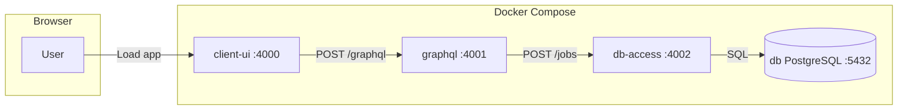

# Job Search Tracker

A monorepo for a **job search tracker** app: a dummy/practice project to explore full-stack patterns and demonstrate proficiency with React, GraphQL, REST, PostgreSQL, and Docker. I wanted to put together something that touches the whole chain—UI, API layer, data access, and database—so it’s still a work in progress and will evolve (e.g. I might move to MongoDB or another NoSQL store instead of PostgreSQL for flexibility, or add auth and more mutations).

I wanted something a bit more interesting than a "TODO App", but it's conceptually the same type of concept. At the time, LinkedIn only had a basic "Saved Jobs" list, so I decided to build something more robust just as a fun exercise. LinkedIn now has more of the functionality one would want from a job tracker, but this project was never meant to be a legit replacement anyway. **A job tracker was merely an answer to *"I want to build something..."*.**

## AI Usage

- **Copilot in vs-code**: standard autocomplete for speed and efficiency, often with predictions that were quite accurate to what I was going to type next anyway (freaky sometimes!).
- **Gemini Chat**: answering my questions when documentation came up short, especially with `drizzle` and `postgreSQL`.
- **Cursor**: generating a good portion of this **README** and making some improvements to Docker configurations.

## What’s in this repo

Three applications that run together under Docker Compose:

| App | Directory | Role |
|-----|-----------|------|
| **client-ui** | `client-ui/` | Web UI (React, SSR). Serves the app and proxies GraphQL to the API. |
| **graphql-api** | `graphql-api/` | GraphQL API (GraphQL Yoga on Hono). Single entry point for the UI; talks to the jobs REST API. |
| **postgresql-db** | `postgresql-db/` | “DB access” REST service (Hono + OpenAPI). Talks to PostgreSQL and exposes a `/jobs` API used by GraphQL. It also contains the database schema definitions for PostgreSQL and an OpenAPI endpoint to expose those same types as JSON schema. |

PostgreSQL runs as a fourth service (`db`) in Compose; only the `postgresql-db` app connects to it.

## How it’s connected



- **User** opens the app in the browser; the page is served by **client-ui**.
- **client-ui** sends GraphQL requests to its own `/graphql` route, which it proxies to **graphql-api**.
- **graphql-api** resolves queries (e.g. `getJobs`) by calling the **db-access** REST API (`POST /jobs`).
- **db-access** uses Drizzle ORM to read/write **PostgreSQL** (`db`).

So: Browser → client-ui → graphql-api → postgresql-db → PostgreSQL.

## Tech stack (by app)

- **client-ui**: React 19, TanStack Router, Chakra UI, urql (GraphQL client), Vite, Hono (SSR server). TypeScript.
- **graphql-api**: GraphQL Yoga, Hono, GraphQL Codegen. TypeScript, Bun.
- **postgresql-db**: Hono, Drizzle ORM, Zod + OpenAPI (Swagger UI at `/openapi/ui`). TypeScript, Bun.
- **db**: Official PostgreSQL image (latest).

All apps are intended to run with **Bun** (because I love it), but the entrypoints could easily be changed to run with Node instead..

## Running locally

Prerequisites: Docker (with Compose), or Bun for running apps individually.

### Run everything with Docker Compose (recommended)

```bash
docker compose up
```

This starts:

- **db** (PostgreSQL) with healthchecks
- **db-access** (postgresql-db) after db is healthy
- **graphql** (graphql-api) after db-access is healthy
- **client-ui** (built from `client-ui/Dockerfile`) after graphql is healthy

Then open **http://localhost:4000** for the UI. The Compose file is set up for **local development** (e.g. watch/restart for code changes on the API and db-access services; client-ui is built and run from the image).

### Production-style run (built images, no watch)

To run with all three apps built as images and no dev watch/volumes:

```bash
docker compose -f compose.yaml -f compose.prod.yaml up --build
```

See “Compose files” below.

### Run apps without Docker

You can run each app on the host with Bun (same ports as in Compose):

1. **PostgreSQL**: run your own Postgres (e.g. local install or a `db`-only Compose) and set `POSTGRES_*` / connection env as in `postgresql-db/drizzle.config.ts`.
2. **postgresql-db**: `cd postgresql-db && bun install && bun run dev` (default port 4002; set `HTTP_PORT` if needed).
3. **graphql-api**: `cd graphql-api && bun install && bun run dev` (default port 4001). Set `JOBS_API_ENDPOINT=http://localhost:4002` so it talks to db-access.
4. **client-ui**: `cd client-ui && bun install && bun run dev` (default port 4000). Set `GRAPHQL_API_ENDPOINT=http://localhost:4001/graphql` for the server-side proxy.

Port defaults: client-ui 4000, graphql 4001, db-access 4002, Postgres 5432.

## Compose files

- **compose.yaml** – Main file for **local development**: db + db-access + graphql + client-ui, with healthchecks, dev watch where applicable, and volume mounts for db-access and graphql so you can edit code and restart without rebuilding. client-ui is built from its Dockerfile.
- **compose.prod.yaml** – Overrides for a **production-style** run: all three apps are built from Dockerfiles, no dev watch, no app volume mounts (only `db-data` remains). Use:  
  `docker compose -f compose.yaml -f compose.prod.yaml up --build`.

## Useful commands (per app)

Run these from each app’s directory (`client-ui/`, `graphql-api/`, `postgresql-db/`). App-level deps: `bun install`. Root repo uses `pnpm` as package manager.

**client-ui**

| Command | Purpose |
|---------|---------|
| `bun run dev` | Dev server with HMR |
| `bun run build` then `bun run start` | Production build and run |
| `bun run generate:routes` | Regenerate TanStack Router route tree |
| (see `package.json`) | GraphQL codegen scripts |

**graphql-api**

| Command | Purpose |
|---------|---------|
| `bun run dev` | Dev server |
| `bun run graphql:types` | Regenerate GraphQL types |

**postgresql-db**

| Command | Purpose |
|---------|---------|
| `bun run dev` | Dev server |
| `bun run drizzle:push` | Push schema to the database |
| `bun run drizzle:studio` | Drizzle Studio (default port 3000) |

## Database

Schema and migrations are in **postgresql-db**: Drizzle schema in `postgresql-db/src/db-schema.ts`, config in `postgresql-db/drizzle.config.ts`. Connection uses `POSTGRES_HOST`, `POSTGRES_USER`, `POSTGRES_PASSWORD`, `POSTGRES_DB`, `POSTGRES_PORT` (Compose passes these to the db and db-access services). After starting the stack, run `bun run drizzle:push` from `postgresql-db/` if you need to apply or update schema.

## Status

This is a **work in progress**. Current state:

- Read path is in place: UI → GraphQL → REST → PostgreSQL for listing jobs (with optional filters).
- Auth, mutations (create/update/delete jobs), and richer features are not implemented yet.
- Docker setup is tuned for local dev and optionally for a production-style run via a second compose file.

I am still working on this and may change database choice, add auth, or refactor the API layer as the project evolves.
