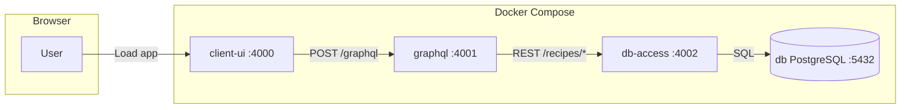

# Demo App - Recipe website

A monorepo for a small **recipe** app: browse published recipes, create your own (draft or published), filter by name, times, ingredients, or author, and save favorites. The stack is the same full-chain exercise as before—**React** UI, **GraphQL** API, **REST** db-access layer, **PostgreSQL**, and **Docker Compose**—without adding new dependencies.

## What’s in this repo

Three applications that run together under Docker Compose:

| App | Directory | Role |
|-----|-----------|------|
| **client-ui** | `client-ui/` | Web UI (React, SSR). Serves the app and proxies GraphQL to the API. |
| **graphql-api** | `graphql-api/` | GraphQL API (GraphQL Yoga on Hono). Resolvers call the db-access REST API. |
| **postgresql-db** | `postgresql-db/` | “DB access” REST service (Hono + OpenAPI). Drizzle + PostgreSQL; recipe CRUD, browse, and saves. Swagger UI at `/openapi/ui`. |

PostgreSQL runs as a fourth service (`db`) in Compose; only the `postgresql-db` app connects to it.

## How it’s connected



- **client-ui** routes: `/` browse, `/recipe/:id` detail, `/my-recipes`, `/my-saves`, `/login`.
- **graphql-api** uses env **`RECIPES_API_ENDPOINT`** (Compose: `http://db-access:4002`) to reach db-access.
- **db-access** exposes OpenAPI-documented routes such as `POST /recipes/published`, `GET /recipes/:id`, `POST /recipes/mine`, `POST /recipes/saved`, `POST/PATCH/DELETE /recipes`, and favorite endpoints.

## Tech stack (by app)

- **client-ui**: React 19, TanStack Router, Chakra UI, urql, Vite, Hono (SSR). TypeScript.
- **graphql-api**: GraphQL Yoga, Hono, GraphQL Codegen. TypeScript, Bun.
- **postgresql-db**: Hono, Drizzle ORM, Zod + OpenAPI. TypeScript, Bun.
- **db**: Official PostgreSQL image (latest).

## Configuration and secrets

- **Local dev**: Defaults in Compose/code are fine for auth and DB (not for real deployments).
- **Production**: Set **`AUTH_JWT_SECRET`** (shared by graphql-api and postgresql-db). See `.env.example`.
- **`RECIPES_API_ENDPOINT`**: Base URL of db-access for graphql-api (e.g. `http://localhost:4002` when running apps on the host).

## Regenerating types

- **graphql-api**: `cd graphql-api && bun run graphql:types` (from [`graphql-api/src/schema.graphql`](graphql-api/src/schema.graphql)).
- **client-ui**: `cd client-ui && bunx graphql-codegen --config codegen.ts` (documents live under `src/components/**/*.tsx`).
- **TanStack Router**: `cd client-ui && bun run generate:routes` after adding or renaming files in `src/routes/`.

## Running locally

### Docker Compose (recommended)

```bash
docker compose up
```

Open **http://localhost:4000**. For a production-style build, use `compose.prod.yaml` as documented in the file headers.

### Without Docker

1. Run PostgreSQL and set `POSTGRES_*` to match `postgresql-db/drizzle.config.ts`.
2. `cd postgresql-db && bun install && bun run dev` (port 4002).
3. `cd graphql-api && bun install && bun run dev` — set `RECIPES_API_ENDPOINT=http://localhost:4002`.
4. `cd client-ui && bun install && bun run dev` — set `GRAPHQL_API_ENDPOINT=http://localhost:4001/graphql` for SSR proxy if needed.

## Database and schema changes

- Schema: [`postgresql-db/src/db-schema.ts`](postgresql-db/src/db-schema.ts) (`recipes`, `recipe_saves`, `users`).
- Apply: `cd postgresql-db && bun run drizzle:push`.


## Status

Core flows are implemented: sign up / log in (cookie JWT), browse with filters, recipe detail, CRUD on own recipes, publish flag, and favorites (“My saves”). Further improvements (pagination, images, search) are optional follow-ups.
